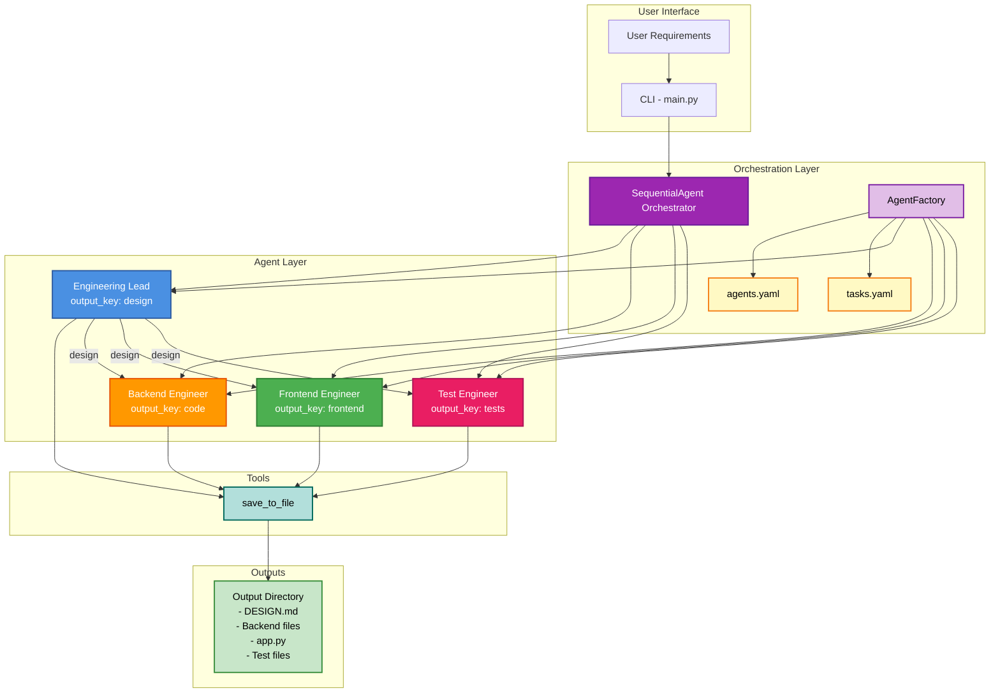
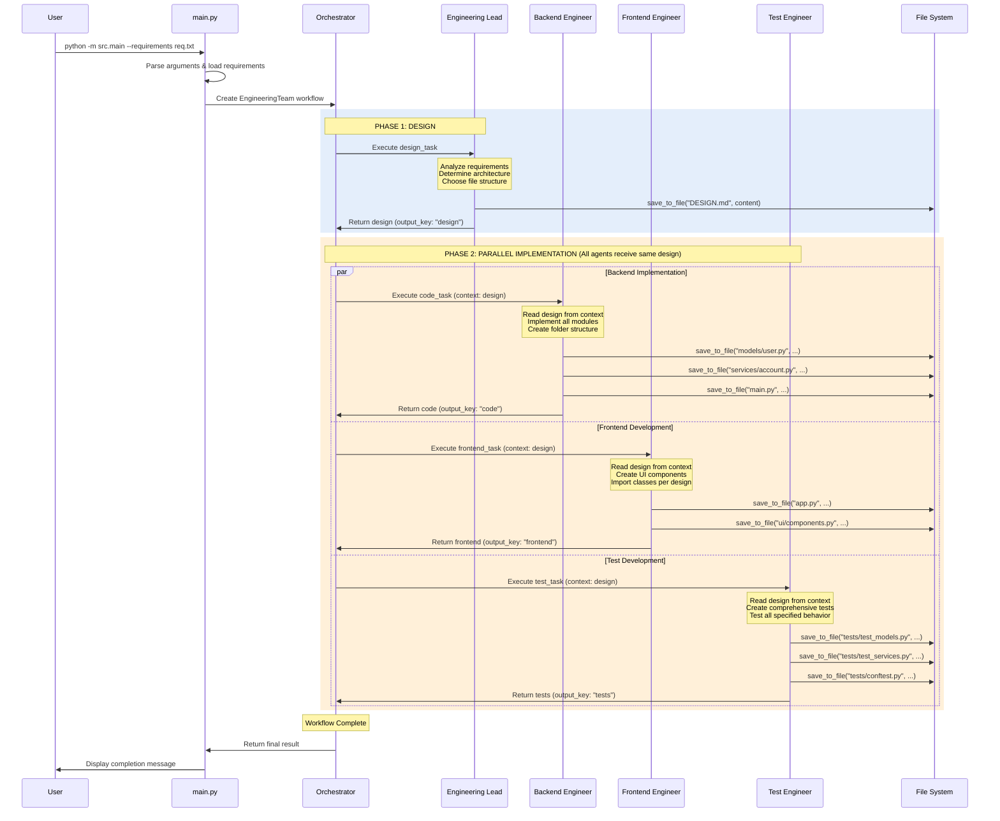

# Engineering Team

A multi-agent system built with Google's Agent Development Kit (ADK) that automates the software development process.

## Overview

The Engineering Team is a multi-agent system that automates the software development process. It uses a **two-phase workflow** for efficient parallel execution:

**Phase 1 - Design:**
1. **Engineering Lead** - Analyzes requirements and creates a detailed design document (DESIGN.md) specifying the architecture, file structure, and module organization

**Phase 2 - Parallel Implementation (all agents work from the same design):**
2. **Backend Engineer** - Implements the complete backend, creating multiple files and folders as specified in the design
3. **Frontend Engineer** - Creates a Gradio UI (and additional UI files if needed) based on the design specification
4. **Test Engineer** - Writes comprehensive test suites based on the design specification

**The application is fully adaptive**:
- **Simple applications** → Single-file implementations (e.g., `calculator.py`, `test_calculator.py`, `app.py`)
- **Complex applications** → Modular structure with multiple files and folders (e.g., `models/`, `services/`, `utils/`, separate test files)
- Agents automatically determine the appropriate level of complexity based on your requirements

## System Design

### Design Overview

The Engineering Team follows a **sequential multi-agent architecture** where specialized agents collaborate to transform high-level requirements into a complete, tested software application. The design emphasizes:

1. **Separation of Concerns**: Each agent has a single, well-defined responsibility
2. **Sequential Execution**: Agents run in a specific order, with each agent building upon the work of previous agents
3. **State Sharing**: Agents communicate through a shared context using output keys
4. **Tool-Based Actions**: Agents use tools (like `save_to_file`) to perform concrete actions
5. **Adaptive Complexity**: The system scales from simple single-file applications to complex multi-module architectures

### Agent Communication Architecture



**Communication Flow:**
- **AgentFactory** reads YAML configs and creates agents with their tools
- **SequentialAgent** orchestrates the workflow
- **Phase 1 (Design)**: Engineering Lead creates DESIGN.md
- **Phase 2 (Implementation)**: Backend, Frontend, and Test all receive the design and work in parallel
  - Backend Engineer implements the code based on design
  - Frontend Engineer creates UI based on design
  - Test Engineer writes tests based on design
- Each agent produces output stored in a **context** with a unique `output_key`
- All implementation agents access the **design** output from Engineering Lead through the `context` parameter
- All agents use the **save_to_file** tool to write files to the output directory

### Workflow Sequence



**Execution Steps:**

1. **Initialization**: User provides requirements via CLI, which creates the workflow
2. **Phase 1 - Design**: Engineering Lead analyzes requirements and creates DESIGN.md
3. **Phase 2 - Parallel Implementation**: All three engineers work simultaneously from the same design:
   - **Backend Engineer** reads the design and implements all backend modules
   - **Frontend Engineer** reads the design and creates Gradio UI
   - **Test Engineer** reads the design and creates comprehensive tests
4. **Completion**: All files are saved to the output directory, workflow completes

**Key Advantage**: Backend, Frontend, and Test engineers can work in parallel since they all depend only on the design, not on each other's output. This significantly improves efficiency.

### Key Design Principles

| Principle | Implementation |
|-----------|---------------|
| **Single Responsibility** | Each agent has one clear purpose (design, code, UI, or test) |
| **Dependency Injection** | Tools are injected into agents via YAML configuration |
| **State Management** | Shared context with output keys enables agent communication |
| **Configuration Over Code** | Agent behavior defined in YAML files, not hardcoded |
| **Adaptive Scaling** | Architecture adapts from single-file to multi-module based on complexity |
| **Parallel Processing** | After design phase, Backend/Frontend/Test work in parallel from the same design |
| **Design-Driven Development** | Comprehensive design enables independent parallel implementation |

## Architecture

### Key Components

```
engineering-team/
├── src/
│   ├── __init__.py           # Package initialization
│   ├── agents.py            # AgentFactory for creating agents from YAML configs
│   ├── tools.py             # Utility tools (file I/O)
│   ├── orchestrator.py      # SequentialAgent workflow orchestration
│   ├── main.py             # Entry point
│   └── config/
│       ├── agents.yaml      # Agent definitions (role, goal, backstory, model, tools)
│       └── tasks.yaml       # Task definitions (description, expected output, output file)
├── pyproject.toml           # Project configuration and dependencies
├── requirements.txt         # Dependencies (for pip install)
└── README.md               # This file
```

### How It Works

1. **Configuration-Based**: Agents and tasks are defined in YAML configuration files (`config/agents.yaml` and `config/tasks.yaml`)
2. **AgentFactory**: Dynamically creates agents by reading YAML configs and combining agent properties with task instructions
3. **Two-Phase Execution**:
   - **Phase 1 (Design)**: Engineering Lead creates comprehensive design
   - **Phase 2 (Implementation)**: Backend, Frontend, and Test engineers work in parallel from the same design
4. **Adaptive Architecture**: The Engineering Lead analyzes requirements and determines:
   - Whether a simple single-file or complex multi-file structure is appropriate
   - Folder organization (e.g., `models/`, `services/`, `tests/`)
   - File and class names based on the domain
5. **Modular Code Generation**: Backend, Frontend, and Test engineers create multiple files as needed using the `save_to_file` tool
6. **Parallel Work**: All implementation agents receive the design and can work independently without waiting for each other
7. **State Sharing**: Agents communicate via `output_key` and access previous results from context
8. **LLM Models**: Uses `gemini-2.0-flash-exp` for all agents (configurable per agent in YAML)

## Tool Philosophy

### Framework Tools vs Domain Logic

The Engineering Team framework distinguishes between two types of functionality:

**Framework Tools** - Meta-operations that enable the framework to function:
- `save_to_file`: Write generated code to the filesystem
- Future: `read_file`, `execute_code`, etc.

**Domain Logic** - Application-specific functionality implemented as generated code:
- Stock price lookups
- Database queries
- API calls
- Business rules

**Philosophy**:
- **Tools = Framework capabilities** that agents need to perform their meta-tasks (saving files, reading configs, etc.)
- **Domain logic = Generated Python code** that the backend engineer agent writes as part of the application
- This keeps the framework generic and reusable across any domain

**Example**: If you're building a trading application that needs stock prices:
- ❌ **Don't** add `get_share_price` as a framework tool
- ✅ **Do** let the backend engineer generate a Python module with a `get_share_price()` function

### Custom Tools (Advanced)

For advanced users who need domain-specific tools **during development** (not in the final application), the framework supports a plugin architecture for custom tools.

**When to use custom tools**:
- You need to call external APIs during code generation
- You have domain-specific utilities that multiple agents need during development
- You want agents to interact with external systems while generating code

**When NOT to use custom tools**:
- The functionality is part of the final application → Generate it as code instead
- Only one part of the application needs it → Generate it as a regular function

See the "Using Custom Tools" section below for implementation details.

## Installation

### Prerequisites

- Python 3.12 or higher
- Google ADK installed and configured
- API credentials for Google AI Studio or Vertex AI

### Setup

1. Install dependencies (choose one method):

   **Using pip:**
   ```bash
   pip install -r requirements.txt
   ```

   **Using pyproject.toml (recommended):**
   ```bash
   pip install -e .
   ```

2. Configure authentication for Google ADK:
   - **Option 1 - Google AI Studio**: Set your API key
     ```bash
     export GOOGLE_API_KEY="your-api-key"
     ```
   - **Option 2 - Vertex AI**: Configure Google Cloud credentials
     ```bash
     gcloud auth application-default login
     ```

## Usage

### Basic Usage

Create a requirements file (e.g., `my_requirements.txt`):

```
Build a todo list application with the following features:
- Create new tasks with title and description
- Mark tasks as complete/incomplete
- Delete tasks
- List all tasks
- Filter tasks by status (completed/pending)
```

Then run:

```bash
python -m src.main --requirements my_requirements.txt
```

This will generate files in the `output/` directory. The Engineering Lead agent will determine appropriate file and class names based on the requirements.

### Specifying Output Directory

You can specify a custom output directory:

```bash
python -m src.main --requirements my_requirements.txt --output my_project
```

### Command-Line Options

```
--requirements, -r  Path to a text file containing project requirements (required)
--output, -o        Output directory for generated files (default: output)
--help, -h          Show help message
```

### Examples

**Example 1: Basic usage with requirements file**
```bash
python -m src.main --requirements todo_requirements.txt
```

**Example 2: Custom output directory**
```bash
python -m src.main -r calculator_spec.txt -o calculator_output
```

**Example 3: Short flags**
```bash
python -m src.main -r requirements.txt -o build
```

### Expected Output

The application generates files in the specified output directory based on the complexity of your requirements:

**Always generated:**
1. **DESIGN.md** - Comprehensive design document specifying architecture and file structure

**For simple applications:**
2. **Single backend file** (e.g., `calculator.py`) - Complete implementation in one module
3. **app.py** - Gradio UI to demonstrate the backend
4. **Single test file** (e.g., `test_calculator.py`) - Unit tests

**For complex applications:**
2. **Multiple backend files and folders** - Modular structure, for example:
   - `models/user.py`, `models/transaction.py`
   - `services/account_service.py`
   - `utils/validators.py`
   - `main.py` or entry point
3. **app.py** (and potentially UI components) - Gradio interface
4. **Multiple test files** - Comprehensive test suite, for example:
   - `tests/test_models.py`
   - `tests/test_services.py`
   - `tests/conftest.py`

The Engineering Lead agent determines the appropriate structure based on your requirements.

### Creating a Requirements File

A requirements file should contain a clear description of what you want to build. Here's a template:

```
Build a [type of application] that includes:

Core Features:
- [Feature 1]
- [Feature 2]
- [Feature 3]

Requirements:
- [Requirement 1]
- [Requirement 2]

Technical Notes:
- [Any specific technical requirements or constraints]
```

## Key Features

1. **Parallel Execution**: Backend, Frontend, and Test engineers work simultaneously from the same design, improving efficiency
2. **Design-Driven Development**: Comprehensive design document enables independent parallel work without inter-dependencies
3. **Adaptive Complexity**: Automatically determines whether to generate simple single-file or complex multi-file architectures based on requirements
4. **Modular Code Generation**: Agents can create multiple files and folder structures for complex applications
5. **YAML Configuration**: Agents and tasks are defined in YAML configuration files for easy customization without code changes
6. **AgentFactory Pattern**: Uses a factory class to dynamically create agents from YAML configs
7. **Two-Phase Workflow**: Design phase followed by parallel implementation phase
8. **Combined Instructions**: Agent properties (role, goal, backstory) and task properties (description, expected_output) are intelligently combined into comprehensive instructions
9. **State Management**: Agents communicate via `output_key` and access previous results from context
10. **Simple Tool Definition**: Tools are plain Python functions that can be easily registered and referenced by name in configs
11. **Flexible Model Selection**: Models are specified per-agent in YAML (supports Gemini, GPT, Claude, and more)

## Agent Details

### Engineering Lead
- **Model**: gemini-2.0-flash-exp
- **Tools**: save_to_file
- **Output**: DESIGN.md - Design specification in Markdown format
- **Output Key**: "design"

### Backend Engineer
- **Model**: gemini-2.0-flash-exp
- **Tools**: save_to_file
- **Output**: One or more Python modules (simple apps: single file; complex apps: multiple files/folders)
- **Output Key**: "code"

### Frontend Engineer
- **Model**: gemini-2.0-flash-exp
- **Tools**: save_to_file
- **Output**: app.py and optionally additional UI component files
- **Output Key**: "frontend"

### Test Engineer
- **Model**: gemini-2.0-flash-exp
- **Tools**: save_to_file
- **Output**: One or more test files (simple apps: single file; complex apps: multiple test files)
- **Output Key**: "tests"

## Development

### Adding New Agents

1. Add the agent definition to `config/agents.yaml`:
```yaml
my_new_agent:
  role: >
    A brief description of the agent's role
  goal: >
    What the agent should accomplish
    Requirements: {requirements}
  backstory: >
    Background information about the agent's expertise
  model: gemini-2.0-flash-exp
  tools:
    - tool_name_1
    - tool_name_2
  output_key: my_output
```

2. Add the corresponding task to `config/tasks.yaml`:
```yaml
my_new_task:
  description: >
    Detailed description of what the agent should do.
    If creating multiple files, instruct the agent to use save_to_file for each file.
  expected_output: >
    What format and content the output should have.
    Specify if the agent should create one file or multiple files.
  agent: my_new_agent
  context:
    - previous_task  # Optional: tasks that must run before this one
  output_file: output.txt  # Optional: only if agent creates exactly one file
```

3. Update the agent-task mapping in `agents.py`:
```python
agent_task_mapping = {
    'engineering_lead': 'design_task',
    'backend_engineer': 'code_task',
    'frontend_engineer': 'frontend_task',
    'test_engineer': 'test_task',
    'my_new_agent': 'my_new_task'  # Add this line
}
```

4. Add the agent to the workflow in `orchestrator.py`:
```python
self.my_new_agent = agents_dict['my_new_agent']
self.team = SequentialAgent(
    sub_agents=[..., self.my_new_agent]
)
```

### Adding Framework Tools

Framework tools are meta-operations that all agents might need (file I/O, execution, etc.).

1. Add the tool as a Python function in `src/tools.py`:

```python
def my_framework_tool(arg1: str, arg2: int) -> str:
    """
    Description of what the tool does.

    Args:
        arg1: Description of arg1
        arg2: Description of arg2

    Returns:
        Description of return value
    """
    # Implementation
    return result
```

2. Register the tool in `src/agents.py` TOOL_REGISTRY:

```python
TOOL_REGISTRY = {
    'save_to_file': save_to_file,
    'my_framework_tool': my_framework_tool,  # Add this line
}
```

3. Reference the tool by name in your YAML configs:

```yaml
my_agent:
  tools:
    - my_framework_tool
```

### Using Custom Tools

Custom tools are domain-specific tools that you need during code generation. They're loaded from external Python modules.

**Step 1**: Create a custom tools module (e.g., `custom_tools.py` in your project root):

```python
"""Custom tools for my domain-specific application."""

def get_share_price(symbol: str) -> float:
    """Get current stock price from API."""
    # Call actual API here
    return api.get_price(symbol)

def query_database(query: str) -> dict:
    """Execute database query."""
    # Connect to real database
    return db.execute(query)
```

**Step 2**: Configure an agent to use custom tools in `src/config/agents.yaml`:

```yaml
backend_engineer:
  role: >
    Python Engineer who implements the architecture
  goal: >
    Implement the complete backend...
  backstory: >
    You're a seasoned Python engineer...
  model: gemini-2.0-flash-exp
  tools:
    - save_to_file      # Framework tool
    - get_share_price   # Custom tool from custom_tools.py
    - query_database    # Another custom tool
  custom_tools_module: "custom_tools"  # Specify the module name
  output_key: code
```

**Step 3**: Run your workflow normally. The custom tools will be automatically loaded and available.

**How it works**:
- The framework imports your `custom_tools` module
- All callable functions (not starting with `_`) become available as tools
- Custom tools are checked first, then framework tools
- Each agent can use different custom tool modules if needed

**Example use case**:
You're building a trading application and want the backend engineer to query real-time stock prices **during code generation** to validate logic or generate test data. The `get_share_price` custom tool allows this, while the generated application code will have its own stock price functionality.

## Troubleshooting

### Authentication Issues
- Ensure your Google API key or Google Cloud credentials are properly configured
- Verify you have access to the Gemini API

### Module Import Errors
- Make sure you're running from the correct directory
- Check that all dependencies are installed: `pip install -r requirements.txt`

### Agent Execution Issues
- Review the agent instructions for clarity
- Check that tools are properly defined and accessible
- Verify the model name is correct (e.g., "gemini-2.0-flash-exp")

## Resources

- [Google ADK Documentation](https://google.github.io/adk-docs/)
- [Google ADK GitHub](https://github.com/google/adk-python)
- [Google ADK Samples](https://github.com/google/adk-samples)
- [Gemini API Documentation](https://ai.google.dev/docs)

## License

MIT License - See LICENSE file for details.
